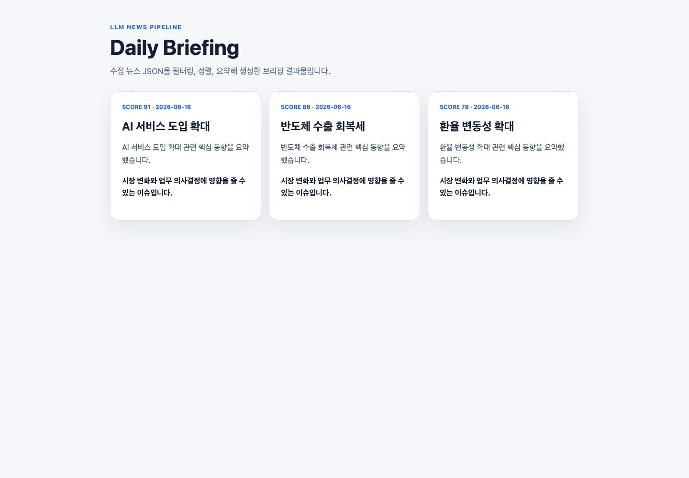

# LLM News Briefing Pipeline

뉴스 JSON 데이터를 단계별로 처리해 데일리 브리핑 결과물을 생성하는 Python 자동화 파이프라인 데모입니다. 실제 LLM API 키 없이 mock client로 동작하며, 필터링부터 HTML 생성까지 재현 가능한 처리 흐름을 보여줍니다.



## Portfolio Summary

- 업무 범위: Python 자동화, JSON 파이프라인, 뉴스 선별, LLM API 연동 구조 설계, HTML 결과물 생성
- 적용 분야: Gen AI 서비스, 업무자동화/RPA, 콘텐츠 자동 생성, 데일리 리포트
- 포트폴리오 상세: [PORTFOLIO.md](./PORTFOLIO.md)

## 문제 상황

뉴스 브리핑을 LLM 한 번의 호출로만 생성하면 결과 검증과 디버깅이 어렵습니다. 이 데모는 사전 필터링, 중복 제거, 우선순위 선별, 요약, HTML 생성 단계를 분리해 각 단계의 입력과 출력을 추적할 수 있도록 구성했습니다.

## 주요 기능

- 원본 뉴스 JSON 로딩
- 필수 필드 기준 사전 필터링
- 중복 제거와 점수 기반 우선순위 정렬
- 요약/시사점 생성 mock 단계
- 체크포인트 저장
- `output/briefing.html` 결과물 생성

## 기술 스택

- Python
- JSON 기반 데이터 파이프라인
- HTML 리포트 생성
- Claude/OpenAI API 확장 가능 구조

## 실행 방법

```bash
python3 src/pipeline.py
```

결과는 `output/briefing.html`에 생성됩니다.

## 실서비스 확장 방향

- Claude/OpenAI API 연동
- JSON Schema 또는 Pydantic 기반 응답 검증
- 지수 백오프 재시도 처리
- GitHub Pages 자동 게시
- 음성 파일 생성 및 메신저 발송 연동
